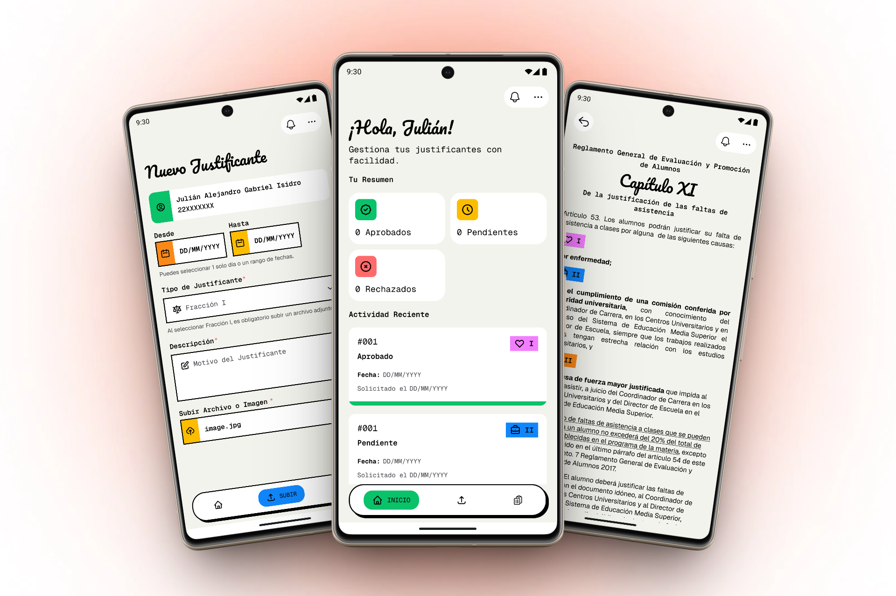

# Justificantes CUCSUR - Aplicación Móvil

Este proyecto consiste en el desarrollo de una aplicación móvil para el sistema de justificantes del **Centro Universitario de la Costa Sur (CUCSUR)**.

---

## Vista Previa



---

## Stack Tecnológico

El proyecto está diseñado con:

- **Entorno**: [Expo SDK 56](https://docs.expo.dev/versions/v56.0.0/) (React Native con Expo).
- **Estilos**: [Uniwind](https://github.com/uniwind/uniwind) + [TailwindCSS v4](https://tailwindcss.com/).
- **Gestor de Paquetes**: [Bun](https://bun.sh/).
- **Enrutamiento**: [Expo Router](https://docs.expo.dev/router/introduction/).
- **Animaciones e Interacciones**: [React Native Reanimated](https://docs.swmansion.com/react-native-reanimated/) y [React Native Gesture Handler](https://docs.swmansion.com/react-native-gesture-handler/) para micro-interacciones de alta fidelidad.
- **Lenguaje**: TypeScript.

---

## Flujos de la Aplicación

La aplicación se estructura en flujos según el rol del usuario autenticado:

### Flujo de Estudiantes

Diseñado para facilitar la solicitud de justificantes:

- **Panel Principal (Dashboard)**: Visualización rápida del estado de sus justificantes recientes y accesos rápidos.
- **Solicitud de Justificante**: Formulario intuitivo para rellenar datos de inasistencia y cargar archivos/evidencias médicas o personales.
- **Historial de Solicitudes**: Listado completo de trámites realizados con filtros de estado (Aprobado, Pendiente, Rechazado).
- **Reglamento Académico**: Sección informativa con las reglas de justificación vigentes en CUCSUR.
- **Notificaciones**: Alertas integradas para avisar al alumno de inmediato cuando su coordinador actualiza el estado de una solicitud.

### Flujo de Coordinadores

Una herramienta optimizada para la toma de decisiones por parte de la administración académica:

- **Bandeja de Pendientes**: Listado de solicitudes pendientes de revisión.
- **Detalle de Justificante**: Pantalla detallada para examinar la información de la inasistencia del alumno y visualizar las pruebas o archivos adjuntos.
- **Aprobación / Rechazo**: Acciones rápidas con retroalimentación inmediata para dictaminar justificantes.
- **Historial General**: Búsqueda e histórico de todos los justificantes procesados por la carrera o departamento.

---

## Estructura del Proyecto

El código fuente está organizado de forma modular dentro del directorio `src`:

```bash
src/
├── app/
│   ├── (auth)/           # Flujo de autenticación (Login, Registro)
│   ├── (coordinator)/    # Pantallas y pestañas exclusivas del Coordinador
│   ├── (student)/        # Pantallas y pestañas exclusivas del Estudiante
│   ├── _layout.tsx       # Layout raíz del enrutador
│   └── index.tsx         # Punto de entrada y redirección inicial
├── assets/               # Fuentes, imágenes y recursos estáticos
├── components/           # Componentes UI reutilizables (Botones, Tarjetas, Inputs, etc.)
├── context/              # Proveedores de contexto globales (Autenticación, Ajustes)
├── hooks/                # Hooks personalizados de React
├── services/             # Integración con APIs y peticiones de red
├── types/                # Definiciones de tipos y esquemas TypeScript
├── utils/                # Utilidades y funciones auxiliares
└── global.css            # Configuración de estilos globales con TailwindCSS / Uniwind
```

---

## Inicio Rápido

Sigue estos pasos para ejecutar el proyecto en tu entorno local.

### Requisitos Previos

Asegúrate de tener instalado [Bun](https://bun.sh/) en tu sistema.

### 1. Instalar dependencias

Clona el repositorio e instala los paquetes necesarios ejecutando:

```bash
bun install
```

### 2. Iniciar el servidor de desarrollo

Para iniciar el servidor de desarrollo de Expo:

```bash
bun start
```

### 3. Ejecutar en Emuladores o Dispositivos

Una vez iniciado el servidor, puedes presionar las siguientes teclas en la terminal o usar las opciones correspondientes para probar la app:

- `a` para ejecutar en un emulador de **Android**.
- `i` para ejecutar en un simulador de **iOS**.
- `w` para ejecutar en el **navegador web**.
- También puedes escanear el código QR con la aplicación **Expo Go** en tu dispositivo móvil (dentro de la misma red local).

---

## Scripts Disponibles

En el proyecto se definen los siguientes scripts útiles en `package.json`:

| Comando       | Descripción                                                             |
| :------------ | :---------------------------------------------------------------------- |
| `bun start`   | Inicia el servidor de desarrollo de Expo.                               |
| `bun android` | Inicia la aplicación directamente en el emulador de Android.            |
| `bun ios`     | Inicia la aplicación directamente en el simulador de iOS.               |
| `bun web`     | Levanta la aplicación en modo Web.                                      |
| `bun lint`    | Ejecuta el linter (`eslint`) para validar la calidad del código.        |
| `bun format`  | Aplica formato al código usando `prettier` en todo el directorio `src`. |
